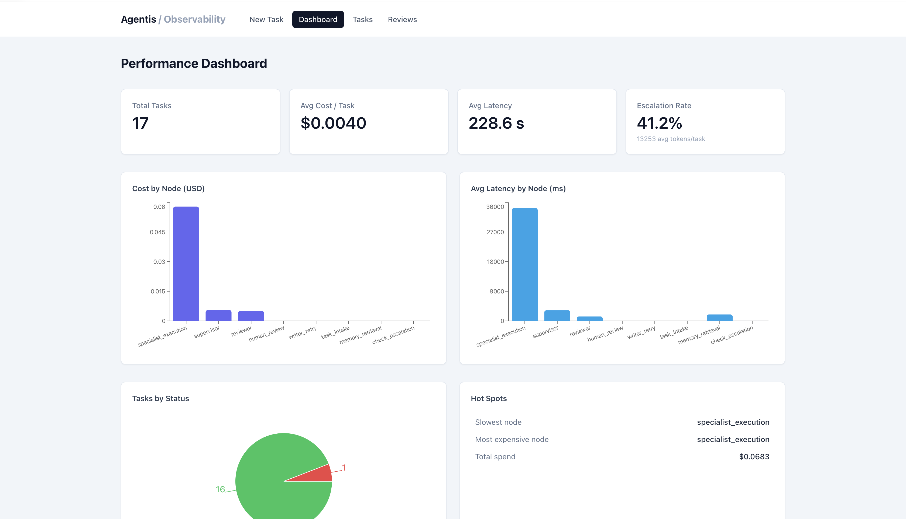
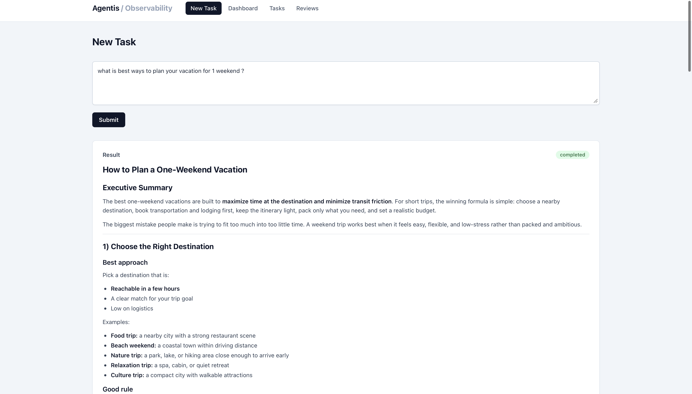
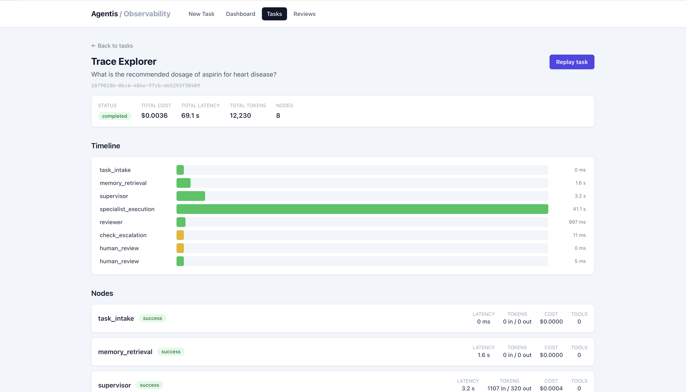
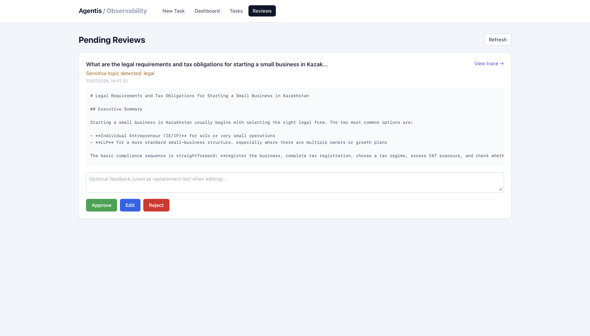

# Agentis — Multi-Agent Research Orchestration System


A production-grade multi-agent AI system where a Supervisor Agent decomposes complex research tasks, delegates to specialized agents with real tool use, maintains persistent memory across sessions, escalates to human operators when confidence is low, and provides full observability into every agent decision and cost.

## Architecture

```
User Request (Chat UI)
        ↓
   FastAPI Backend
        ↓
   LangGraph Graph
        ↓
┌──────────────────────────────────────────┐
│  task_intake → memory_retrieval          │
│       ↓                                  │
│  supervisor_planning (GPT)               │
│       ↓                                  │
│  specialist_execution (parallel)         │
│  ├── Researcher (Tavily web search)      │
│  ├── Analyst (code execution)            │
│  └── Writer (report generation)          │
│       ↓                                  │
│  reviewer_validation                     │
│       ↓                                  │
│  check_escalation                        │
│  ├── [approved] → END                    │
│  └── [escalated] → human_review → END   │
└──────────────────────────────────────────┘
        ↓                    ↓
   Memory System        Observability
   ├── Redis             ├── Trace Explorer
   └── ChromaDB          ├── Cost tracking
                         └── Replay system
```

The graph is a LangGraph `StateGraph` compiled with an `AsyncPostgresSaver` checkpointer, which is what makes `human_review` a real pause-and-resume step rather than a blocking wait — the process can restart entirely and still resume a paused task from PostgreSQL.

## Key Features

- **Multi-agent orchestration** with LangGraph `StateGraph` — Supervisor, Researcher, Analyst, Writer, and Reviewer roles with a conditional retry edge
- **Parallel specialist execution** with `asyncio.gather()` — independent subtasks (`depends_on=[]`) run concurrently instead of strictly sequentially
- **Persistent memory**: Redis (working memory, 24h TTL) + ChromaDB (semantic/vector long-term memory with decay & consolidation)
- **Human-in-the-Loop**: 3 escalation triggers (sensitive keywords, low reviewer score after retries, explicit agent flag) + an approval queue with approve/edit/reject
- **Full observability**: per-node execution traces, cost & token accounting per agent, and a task replay system
- **Provider-agnostic LLM client** — swap OpenAI for Anthropic (or any LangChain chat model) without touching a single agent file
- **React dashboard** with a performance overview, Trace Explorer, HITL review queue, and a Chat UI for submitting tasks
- **110 tests** (102 unit + 8 integration), 0 failures

## Tech Stack

| Component | Technology | Purpose |
|---|---|---|
| Orchestration | LangGraph | Agent state machine |
| LLM | OpenAI GPT | All agent reasoning |
| Embeddings | OpenAI | Semantic memory search |
| Vector DB | ChromaDB | Long-term memory |
| Working Memory | Redis | Per-task scratch space |
| Database | PostgreSQL | Tasks, traces, logs |
| Web Framework | FastAPI | REST API |
| Frontend | React + Tailwind | Dashboard + Chat UI |
| Observability | Custom tracer | Cost + latency tracking |
| Containers | Docker Compose | Full system orchestration |
| Testing | pytest | 110 tests |

## Quick Start

1. Clone the repo
2. Copy `backend/.env.example` to `backend/.env` and fill in:
   `OPENAI_API_KEY`, `TAVILY_API_KEY`, `LANGCHAIN_API_KEY`
3. `docker-compose up --build`
4. Open http://localhost:3000

## Screenshots






## API Overview

| Method | Endpoint | Description |
|---|---|---|
| POST | `/tasks` | Submit a research task |
| GET | `/tasks/{id}` | Get task status and result |
| GET | `/tasks/{id}/trace` | Full execution trace with costs |
| POST | `/tasks/{id}/replay` | Replay a past task |
| GET | `/reviews/pending` | Human review queue |
| POST | `/reviews/{id}/decision` | Approve/edit/reject |
| GET | `/stats/performance` | Aggregated metrics |
| GET | `/api/memory/dashboard/{user_id}` | Memory stats |

## Project Structure

```
agentis/
├── backend/
│   ├── app/
│   │   ├── main.py                       # FastAPI app factory + startup lifecycle
│   │   ├── checkpointer.py               # AsyncPostgresSaver — enables graph pause/resume
│   │   ├── llm/
│   │   │   └── client.py                 # Provider-agnostic LLM client (call_llm)
│   │   ├── agents/
│   │   │   ├── supervisor.py             # Task decomposition → ExecutionPlan
│   │   │   ├── reviewer.py               # Quality scoring + retry feedback loop
│   │   │   └── specialists/
│   │   │       ├── researcher.py         # Web search + synthesis
│   │   │       ├── analyst.py            # Structured analysis (+ code execution)
│   │   │       └── writer.py             # Final report generation
│   │   ├── graph/
│   │   │   ├── state.py                  # AgentState TypedDict + Pydantic models
│   │   │   └── graph.py                  # LangGraph StateGraph + parallel scheduler
│   │   ├── memory/
│   │   │   ├── working_memory.py         # Redis per-task scratchpad
│   │   │   ├── semantic_memory.py        # ChromaDB long-term memory
│   │   │   ├── retrieval.py              # Memory context injection for planning
│   │   │   └── management.py             # Decay, consolidation, dashboard stats
│   │   ├── observability/
│   │   │   └── tracing.py                # traced_node wrapper — cost/latency/metadata
│   │   ├── tools/
│   │   │   ├── registry.py               # Tool registry with per-agent allowlists
│   │   │   ├── web_search.py             # Tavily web search
│   │   │   └── code_execution.py         # Sandboxed Python subprocess
│   │   ├── db/
│   │   │   ├── models.py                 # Task, SubtaskLog, ExecutionTrace, HumanReview
│   │   │   └── queries.py                # Async query helpers
│   │   └── routers/
│   │       ├── tasks.py                  # POST /tasks, GET /tasks/{id}
│   │       ├── traces.py                 # GET /tasks/{id}/trace, replay
│   │       ├── reviews.py                # HITL approval queue
│   │       ├── stats.py                  # Dashboard aggregates
│   │       └── memory.py                 # Memory dashboard + search API
│   ├── tests/                            # 102 unit tests + test_e2e.py (8 integration)
│   ├── requirements.txt
│   └── Dockerfile
├── frontend/
│   └── src/
│       ├── pages/
│       │   ├── Chat.jsx                  # Task submission + live progress + markdown result
│       │   ├── Dashboard.jsx             # Cost/latency charts, task status breakdown
│       │   ├── Reviews.jsx               # HITL approval queue UI
│       │   └── TraceExplorer.jsx         # Per-node execution trace viewer
│       └── api.js                        # Central REST client
└── docker-compose.yml
```

## Engineering Decisions

- **Why LangGraph over a simple chain** — a state machine with conditional edges gives explicit retry logic (`route_after_review`) and pause/resume semantics for human-in-the-loop, instead of burying control flow inside nested if/else blocks.
- **Why ChromaDB for long-term memory** — semantic search finds conceptually similar past tasks by meaning ("AI market" ≈ "artificial intelligence industry"), not exact key lookup, so the Supervisor can reuse effective approaches even when phrased differently.
- **Why `asyncio.gather()` for parallel execution** — it's non-blocking and shares the same event loop as FastAPI, so independent subtasks overlap in wall time with zero thread-pool or process overhead.
- **Why the `traced_node` wrapper pattern** — every node is instrumented transparently via a decorator; observability (cost, latency, token counts) is fully decoupled from agent logic and a trace-write failure can never crash a production node.
- **Why `AsyncPostgresSaver` for checkpointing** — LangGraph needs to persist state somewhere durable to pause a graph mid-execution at `human_review` and resume it later (possibly after a process restart) once a human submits a decision.
- **Why a provider-agnostic LLM client** — `call_llm()` is the only LLM entry point in the codebase; swapping OpenAI for Claude is a one-line `MODEL_REGISTRY` change plus a new branch in `_build_client()`, with zero changes to any agent file.
- **Why Redis for working memory** — sub-millisecond per-task scratch reads/writes, with a native 24-hour TTL so abandoned or crashed task data expires automatically instead of requiring manual cleanup.

## Running Tests

```bash
pytest tests/ --ignore=tests/test_e2e.py   # 102 unit tests
docker compose run --rm test               # 8 integration tests
```
